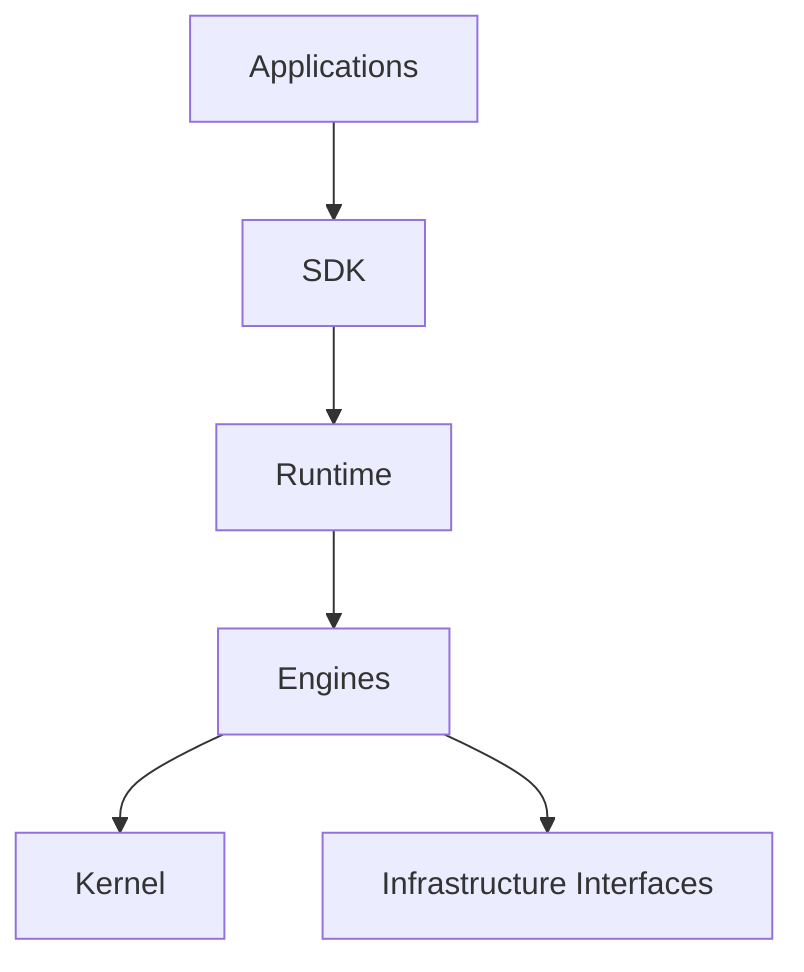

# Architecture

## Dependency Direction

Applications depend on the SDK. The SDK exposes public types and factory functions. Runtime and engine packages remain implementation details.

## Layers

| Layer | Responsibility |
| --- | --- |
| Applications | App-specific workflows and UI in external repositories |
| SDK | Public API |
| Runtime | Runtime composition |
| Engine | Capability, workflow, event, knowledge, plugin behavior |
| Kernel | Result, value objects, errors, clock, logger, DI |
| Infrastructure | Memory, file, environment, future adapters |

## Event Sourcing

Events are the persisted facts. Current state should be reconstructed from events instead of being treated as the source of truth.

Initial infrastructure is memory-only. PostgreSQL, Redis, Kafka, S3, Supabase, and AI providers should be added behind interfaces.

## Capability Runtime

A capability has:

- `id`
- `name`
- `description`
- `permission`
- `input`
- `output`
- `execute()`

The runtime resolves a capability from the registry, checks permission, and executes it.

## Workflow Runtime

Workflows orchestrate capabilities. The first implementation supports:

- workflow definitions
- workflow instances
- approval waiting state
- retry attempts
- rollback and timeout metadata for future execution policies

## AI Runtime

AI runtime is intentionally interface-only at this stage. It will later cover model selection, prompts, memory, context, retry, fallback, cost, and tracing.

