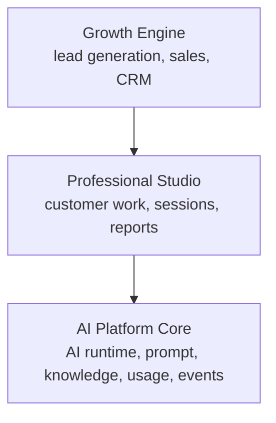
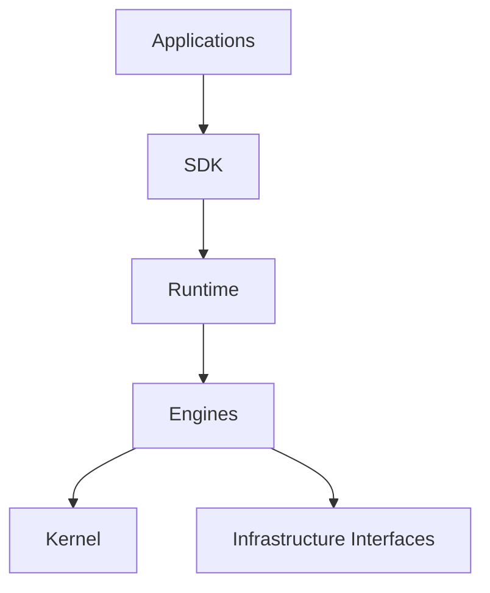

# Architecture

## System Boundary

AI Platform Core is the common AI foundation used by Professional Studio
applications such as Numeria Studio, FP Studio, Coach Studio, Marriage Studio,
and Counselor Studio.

AI Platform Core provides AI capabilities only. It owns AI Runtime, Workflow,
Prompt, Knowledge, Usage, AI Usage Billing records, and Event primitives.
It does not own customer management, SNS, LINE, reservations, sales, payments,
PDF layout, or professional-domain business logic.

Growth Engine owns business decisions and business orchestration. AI Platform
Core must not decide who to follow up with, what to sell, which post to create,
or what business action should happen next. Applications call AI capabilities;
AI Platform Core resolves models, prompt versions, workflows, tools, knowledge,
evaluation, and usage recording behind those capabilities.

Professional Studio modules are exchangeable. A new vertical should be able to
use the same Growth Engine and AI Platform Core without changing either system.

## Dependency Direction

Applications depend on the SDK. The SDK exposes public types and factory functions. Runtime and engine packages remain implementation details.

## Layers

| Layer | Responsibility |
| --- | --- |
| Applications | App-specific workflows and UI in external repositories |
| SDK | Public API |
| Runtime | Runtime composition |
| Engine | Capability, workflow, event, knowledge, plugin behavior |
| Kernel | Result, value objects, errors, clock, logger, DI |
| Infrastructure | Memory, file, environment, future adapters |

## Event Engine

Systems should integrate through publish/subscribe events instead of direct
cross-application calls. AI Platform Core owns generic event primitives and the
shared integration event names, but it does not interpret professional-domain
meaning.

API and Event roles are separate:

- Synchronous reads and immediate user actions use APIs.
- State changes and downstream asynchronous processing use Events.
- Event Engine notifies systems about changes; it is not the business workflow commander.

The Event Engine boundary is adapter-ready:

- `EventPublisher` publishes events.
- `EventSubscriberRegistry` registers and unregisters subscribers.
- `EventStore` appends events and supports filtered reads by aggregate, type, and time.
- Event envelopes carry event ID, version, workspace, producer, correlation ID, subject, payload, and optional partition key.
- Durable adapters must support idempotency, retry, dead-letter handling, consumer processing state, schema validation, audit logs, and replay.
- Memory implementations are default infrastructure; external brokers and stores must implement the same interfaces.

Business Events represent business state changes owned by Growth Engine or
Professional Studio. AI Activity Events represent AI execution state changes
owned by AI Platform Core. Both can use the same Event Engine but must keep
their schemas and responsibilities separate.

Initial Business Events:

- `growth.customer.created.v1`
- `growth.customer.updated.v1`
- `growth.lead.converted.v1`
- `growth.reservation.created.v1`
- `growth.reservation.cancelled.v1`
- `sns.post_draft.created.v1`
- `sns.post_draft.updated.v1`
- `studio.session.started.v1`
- `studio.session.completed.v1`
- `studio.report.generated.v1`
- `studio.service_reference.updated.v1`

`studio.recommendation.created.v1` is pending in the contracts repository and
must not be implemented as a stable integration event until promoted there.

Initial AI Activity Events:

- `ai.activity.created.v1`
- `ai.activity.completed.v1`
- `ai.activity.failed.v1`
- `ai.usage.recorded.v1`

## Event Sourcing

Events are the persisted facts. Current state should be reconstructed from events instead of being treated as the source of truth.

Initial infrastructure is memory-only. PostgreSQL, Redis, Kafka, S3, Supabase, and AI providers should be added behind interfaces.

## External Context

AI Platform Core stores AI-owned records as source of truth: AI Activity,
Prompt, Prompt Version, Workflow, Agent, Tool, Knowledge, Usage, Cost,
Evaluation, and Event.

Business entities remain outside AI Platform Core. Customer source of truth is
Growth Engine. Session and Report source of truth is Professional Studio. AI
Platform Core may record external reference IDs such as `workspaceId`,
`userId`, `ownerUserId`, `projectId`, `professionalStudioType`, `customerId`,
`sessionId`, `reportId`, and `reservationId`, but it must not own CRM,
session, or report records.

For MVP attribution, AI Activity, Usage, and Capability execution history use
`workspaceId + userId` as the primary scope. `workspaceId` represents the
professional's business workspace, `userId` represents the signed-in
professional operating the AI request, and `ownerUserId` may identify the
workspace owner when needed. `professionalId` is not required for MVP and should
be treated only as a future extension point for multi-brand, multi-professional,
or staff operation models.

SNS Planner is operated by Growth Engine. AI Platform Core may execute a
capability such as `Marketing.GenerateContentBrief` and return the result to
Growth Engine; Growth Engine decides whether and how to request SNS Planner work.
SNS Planner receives post creation inputs such as `purpose`, `targetAudience`,
`cta`, `channel`, `tone`, and `constraints`; it does not own business targeting,
offer, or CTA decisions.

## Capability Runtime

A capability has:

- `id`
- `name`
- `description`
- `permission`
- `input`
- `output`
- `execute()`

The runtime resolves a capability from the registry, checks permission, and executes it.

Applications must call capabilities instead of directly sending prompt text or
model names. Example capabilities include `Reading.Interpret`,
`Reading.GenerateDraft`, `Marketing.AnalyzeFunnel`,
`Marketing.GenerateContentBrief`, `Marketing.RecommendFollowup`,
`Marketing.RecommendRepeat`, and `Marketing.AnalyzeRevenue`.

## Workflow Runtime

Workflows orchestrate capabilities. The first implementation supports:

- workflow definitions
- workflow instances
- approval waiting state
- retry attempts
- rollback and timeout metadata for future execution policies

## AI Runtime

AI runtime is intentionally interface-only at this stage. It will later cover model selection, prompts, memory, context, retry, fallback, cost, and tracing.
